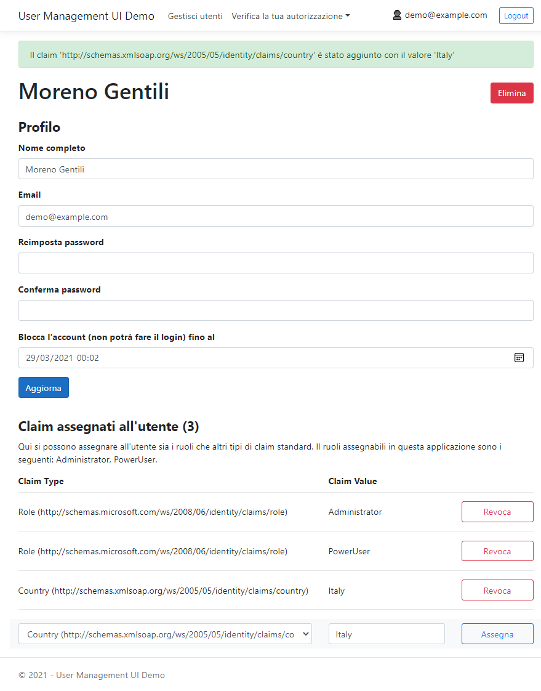

# User Management UI Demo

Applicazione ASP.NET Core 8 che dimostra come usare lo `UserManager<TUser>` per assegnare ruoli e altro tipo di claim agli utenti.

> Visita anche il ramo GIT `RoleManager` per scoprire come usare il servizio `RoleManager<TRole>` per creare dei ruoli arbitrari a cui possono essere assegnati dei claim.

